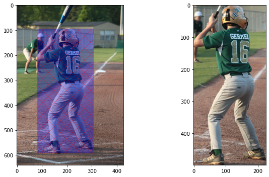
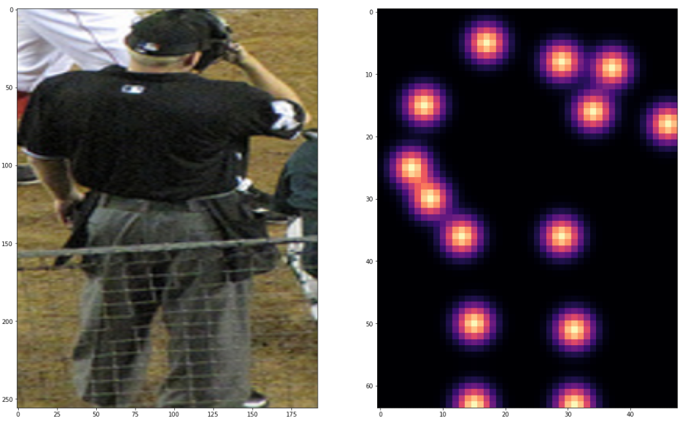

# Human Pose Estimator

## Introduction
This project is a solution for the live project on the [Manning publications website](https://www.manning.com/)
. The website provides some instructions and it is up to each participant how to approach the solution. I find it quite interesting
and easy to follow, plus you have to do with something real and develop your skills to the next level.

## Chapter 1
The first chapter is about downloading the datasets and get familiar with them. The two datasets are the [SHVN](http://ufldl.stanford.edu/housenumbers/) 
and the [COCO](https://cocodataset.org/#keypoints-2017). Links are provided for the official websites.

The website provides a script to download the data from an S3 bucket on the AWS cloud. After downloading the data 
I wrote a small script to visualize and understand the dataset. Running the pose_estimator_01.py you take the 
following results:

This image shows that I successfully draw a box around the human and crop the image to the given coordinates

Same image as before but after I found the box coordinates I plot the key points the represent all the visible
body parts of the human depicted on the picture

The jupyter notebook with all the code you can find here: [notebok](01.HumanPoseEstimator.ipynb)

## Chapter 2

In this chapter, I will make and train a CNN (Convolution Neural Network) model to recognize numbers depicted on images with street numbers 
(SHVN dataset). To solve this problem I decide to go with CNN architecture as it thrives in image recognition. 

My model architecture consists of two convolution layers followed with a Batch Normalization layer, 
a Relu activation function and a Max-Pool layer. The output of the final convolution layer passes through a Dense layer where all dimensions are flattened and then passed to a final Dense layer where a prediction is made.
 
The final accuracy after 100 epochs of training is 92.1212% on the test set.

This is an image of the loss during the training process.

There is a lot of room for development for this model. The spikes seen on the graph are probably from batch training, and from images that the model has not seen before this batch. Choosing a bigger batch size will probably smooth the loss plot.

Following images with the real and predicted labels.

More you can see in my jupyter notebook: [link](02.SHVNCNN.ipynb)

## Chapter 3

Into this chapter is time to use a pre-trained model to make an object detector. The goal is to detect people on images, but
I will go a step further and let the detector find all the objects in an image. 

### Object Detectors

What is an object detector and how it works?

An object detector can be different things. From a simple program that just finds a group of pixels with specific values
and groups them as an object or a more complex design where we use deep learning to build an accurate object classifier
that is trained on a huge amount of labeled images and can recognize much more on an image.

The main "ingredients" of an object detector are:

-  **A regional proposal**: It's an algorithm that finds Regions Of Interest(ROI) on an image and generates bounding boxes
    around these areas.
    
- **Feature extraction**: This layer extracts from each ROI all possible features it can find, after that its features
is evaluated and more bounding boxes are drawn based on the location of each object.

- **Non-Maximum Suppression**: At this point, we have a lot of boxes predicted for the same objects in slightly different
positions, combining them is the next step and called Non-Maximum Suppression which helps reducing detecting the same object multiple times.

- **IoU**: intersection over union (IoU) is an evaluation metric for our predictions and more specifically is the
metric that shows us how much two bounding boxes are overlapping each other. 

For this project, I used the Faster R-CNN (link to [paper](https://arxiv.org/pdf/1506.01497.pdf)) architecture. It is fast
and accurate while is using pre-trained CNN to extract the feature maps instead of a regional proposal algorithm. 
(More information can be found in the paper or other online sources)

### Results
After implementing the code for object detection where you can find [here](03.HumanDetection.ipynb) these are the results:

For each label is drawn a boundary box, the label is also plotted as the accuracy for each prediction

## Chapter 4

In this last chapter, I built and train a CNN model to detect all the keypoints on an image.

### Approach

Thinking of the problem we have to deal with the approach we have to take is to make a CNN, feed it with images and 
the coordinates of the keypoints on the image and let the model train, and hopefully, it will make some accurate predictions 
on some unseen images.

But before go so far and make the model we have to think about how to approach this. We want to predict keypoints as coordinates,
so we can make the model predict discreet values for each image. This approach as good as it sounds it is quite tedious, while we
have to predict values with very little tolerance, so the model has to be quite accurate.

The approach that is proposed by the project's authors is to predict a heatmap with all the keypoints of the image. 
To do this we have to feed into the model one heatmap for each keypoint alongside the original image. So we don't have
to predict discrete values, but an image showing the heatmap. 

For this method, we are going to need a different way to calculate the accuracy of the model. You can find the original code
[here](calculate_accuracy.py). This method calculates the Percentage of Correct Key-points (PCK) and used it as it was proposed.

### Results
The model takes some time to train. After that we can load the weights of the model and make some predictions on images 
the model never has seen before. The model has around 0.5 -0.6 accuracy, its not so good but it is ok for a model trainned
on a single gpu and only with 10 epochs.

Input image with original heatmap:

Output predicted heatmap:

 As we can see the model captures quite good the keypoints appearing on the image.